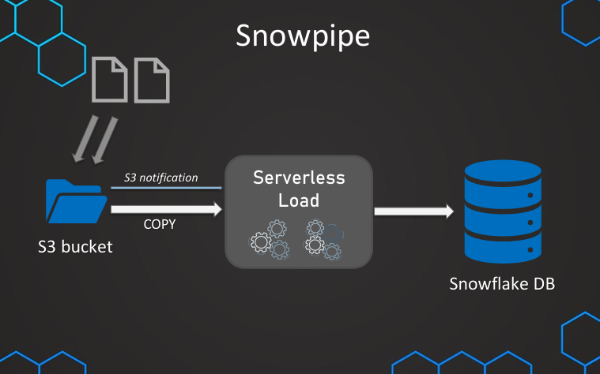

<h1>Overview</h1>
Repository to record learning of advanced Snowflake topics

<h2>Notes</h2>

1. <strong>Loading Data From AWS</strong>  
    &emsp;a. Create IAM role that has access to the S3 bucket and copy the ARN.  
    &emsp;b. Use ./sql/aws/01_creating_storage_integration.sql to create a Storage integration and provide the ARN copied.  
    &emsp;c. Describe the Storage Integration object and get the USER ARN and EXTERNAL ID mentions.  
    &emsp;d. Navigate to the role in AWS and establish Trust Relationship by providing USER ARN and EXTERNAL ID.  
    &emsp;e. Use ./sql/aws/02_loading_data_using_storage_integration.sql to create stage and attach Storage Integration.  
    &emsp;d. Load data from stage created.   
2. <strong>Loading Data From Azure</strong>  
    &emsp;a. Use ./sql/azure/01_creating_storage_integration.sql to create a Storage Integration object.  
    &emsp;&emsp;Tenant ID is available from your azure account and locations to access should be provided.  
    &emsp;b. Describe the Storage Integration object and visit the link under AZURE_CONSENT_URL and grant access.  
    &emsp;c. Go to Azure console and under IAM, and create new Add Role Assignment and assign permission to our containers.  
    &emsp;d. Under Role, select Job Function roles and select Storage Blob Data Container.  
    &emsp;e. Under Members, add member with name same as that which appeared during consent.
    &emsp;&emsp;Can also be found under Storage Integration description as AZURE_MULTITENANT_APP_NAME.  
    &emsp;e. Use ./sql/azure/02_loading_data_using_storage_integration.sql to create stage and attach Storage Integration.  
    &emsp;f. Load data from stage created.   
3. <strong>Snowpipe Overview </strong>  
    Feature of snowflake that enables loading once a file appears in a bucket.  
    It is used when data needs to be immediately available.  
    Snowpipe uses serverless features instead of using traditional warehouses which is managed by Snowflake.  
    Flow diagram of Snowpipe: 
       
4. <strong>Steps for setting up Snowpipe</strong>  
    &emsp;a. Create stage object with Storage integration(is using Storage integration) and file format(or add it in COPY command).  
    &emsp;b. Test COPY command which works as it will be part of the pipe and needs to work properly.  
    &emsp;c. Create the pipe object, describe the pipe and get the <code>notification_channel</code> attribute.  
    &emsp;d. Go to S3 bucket and under <code>properties -> Event notifications</code> and create a new event notification.  
    &emsp;e. Provide the ARN copied after selecting <code>Destination: SQS queue -> Specify SQS queue: Enter SQS name ARN</code>.  
    <em>See ./sql/01_creating_snowpipe.sql</em>   
5. <strong>Monitoring and Managing Snowpipes</strong>  
    <em>See ./sql/02_monitoring_and_managing_pipes.sql</em>  
    <em>Note: Recreating a pipe does not delete metadata related to the pipe or notification channel change. </em>   
6. <strong>Time Travel in Snowflake</strong>  
    Advantages of Time:  
    &emsp;a. We can query deleted or updated data  
    &emsp;b. Restore tables, schemas, and databases that have been dropped  
    &emsp;c. Create clones of tables, schemas and databases from previous state  
    Different ways to use time travel:  
    &emsp;a. <strong>TIMESTAMP</strong>: By providing timestamp from when we want to query.  
    &emsp;b. <strong>OFFSET</strong>: By providing offset i.e. look-back duration (in seconds).  
    &emsp;c. <strong>QUERY ID/ STATEMENT</strong>: By providing query id before which we want to get state as statement.  
    &emsp;d. <strong>UNDROP TABLE/ SCHEMA/ DATABASE</strong>: Undo drop of table, schema or database if within recovery range.  
    <em>Note: Cannot undrop if another object of same name already exists, solution is to rename current object and then undrop.  
    &emsp;Should have ownership privileges for an object to be restored.   
    See ./sql/03_using_time_travel.sql</em>   
7. <strong>Restoring Data Using Time Travel</strong>  
    The usual approach which can cause issue is as follows:  
    &emsp;Using <code>CREATE OR REPLACE TABLE</code> which will create a new table with same name but with different underlying id.  
    &emsp;This will cause us to lose any time travel or history of the previous table with same name but different ID.  
    The recommended approach is as follows:  
    &emsp;a. Create a temp table with state of table which you want to revert to.  
    &emsp;b. Truncate current table. This will retain time travel/ query history of the current table.  
    &emsp;c. Copy values from temp table to current table using <code>INSERT INTO</code> and <code>SELECT</code> commands.  
    <em>See ./sql/04_restoring_data_using_time_travel.sql</em>   
8. <strong>Restoring Data Using UNDROP Command</strong>  
    &emsp;a. We can undrop a dropped table, schema or database with all its objects.  
    &emsp;b. If we have used the bad method of time travel and now unable to get the previous table, we can use rename table and undrop.  
    &emsp;&emsp;i. Rename the current table with same name to a different name table.  
    &emsp;&emsp;ii. Undrop the table with desired name.  
    &emsp;&emsp;iii. Use time travel feature and query history of the desired table.  
    <em>See ./sql/05_restoring_data_using_undrop.sql</em>   
9. <strong>Retention Period</strong>  
    &emsp;a. The default retention period set for tables is 1 day.  
    &emsp;b. The standard edition allows retention for 1 day but other editions can allow increasing retention period up to 90 days.  
    &emsp;c. As we increase the retention period, the storage cost increases with it.  
    &emsp;d. Each time we run a query which has time travel feature associated, we create additional storage for changes made.  
    &emsp;&emsp;These changes history if made for a lot of times can accumulate to cost us high storage charge.  
    <em>See ./sql/06_retention_period.sql for setting retention period and to get cost of each table with time travel</em>   
10. <strong>Fail Safe</strong>  
    Used to recover data from disaster. After the time travel period ends, fail-safe support starts for next 7 days.  
    For recovering data using fail-safe method, we need to reach our to Snowflake team.  
    &emsp;a. It is 7 days for permanent tables and 0 for transient tables.  
    &emsp;b. Storage cost is incurred by us for this fail-safe feature by default.  
    &emsp;c. If the table still exists, but the time travel date has passed, we can get back state using fail-safe feature.  
    <em>See ./sql/07_fail_safe_metric_query.sql</em>   
11. <strong>Types of Tables</strong>  
    &emsp;a. Permanent: Has features of time travel as well as fail-safe. Resides in storage memory until dropped.  
    &emsp;b. Transient: Has features of time travel but not fail-safe. Resides in storage memory until dropped.  
    &emsp;c. Temporary: Has features of time travel but not fail-safe. Resides in storage memory until session ends.  
    <em>Note: Similar to Tables, schemas and other objects can also be permanent, transient or temporary.  
    eg: for schema with transient nature, all tables inside it will be transient only.  
    If we create a temporary table with same name as permanent table in a schema, it will not replace the permanent table.  
    The temporary table will override the permanent table for the session.</em>  
